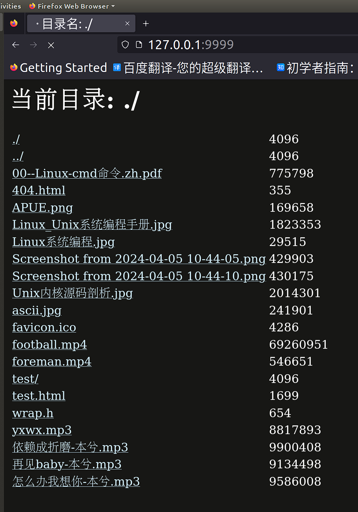

# epollHttpServer

#### 介绍
在`Linux`下用C语言实现一个简单的 Web 服务器 myhttp。能够给浏览器提供服务，供用户借助浏览器访问服务器主机中的文件。

#### 软件架构

C，epoll

#### 使用说明

1. 修改`epollHttpServer.c` 中`#define SERV_PORT 9999`，改成自己需要的

   

2. 修改`epollHttpServer.c` 中`#define MY_DIR "/home/b/dir"`，改成自己的目录，建议用绝对路径

   

3. 打开linux终端， 切换到当前目录，然后输入`make`, 回车, 就会在当前目录生成一个`server`的文件

4. 在当前目录输入`./server`, 即可运行服务器程序

5. 在浏览器打开对应的地址: `Linux的ip地址:上面设置的端口号`，如`127.0.0.1:9999`即可访问。

   

   
